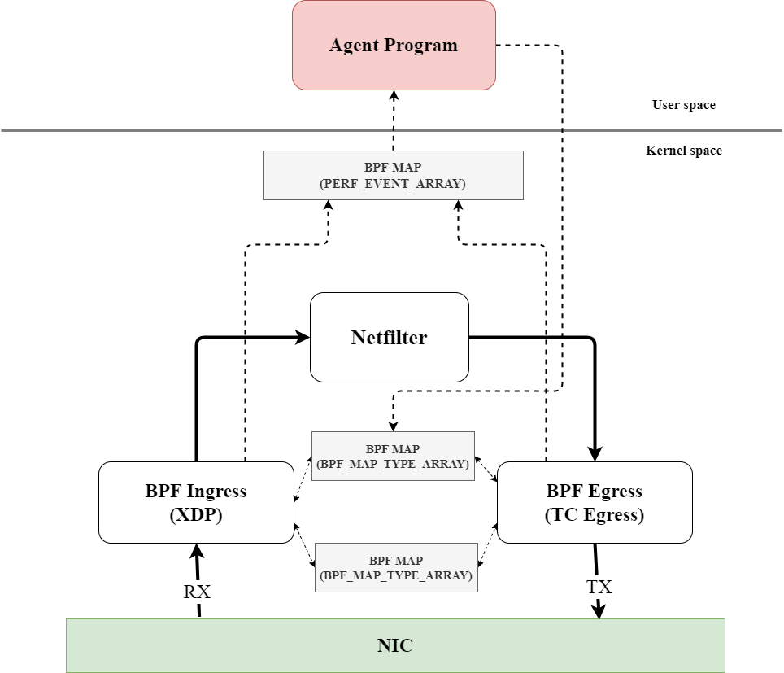

# eBPF that assigns identifiers to SRH to track SRv6 packets.

## Install
```shell
git clone https://github.com/shu1r0/srv6tracing_ebpfagent.git
make install
```

## Usage
```
go run ./cmd/srv6_tracing_agent/main.go -h
Usage of /tmp/go-build941929647/b001/exe/main:
  -ip string
        server ip address (default "[::]")
  -log-file string
        log file (default "/var/log/srv6_ptf/collector-agent.log")
  -log-level string
        log level (panic, fatal, error, warn, info, debug, trace) (default "info")
  -port int
        server port (default 31000)
```

## Architecture




## メモ
- SRHのlenが更新されない兼
  - https://github.com/torvalds/linux/blob/cacc6e22932f373a91d7be55a9b992dc77f4c59b/net/core/filter.c#L6370 このbpf_update_srh_stateは，srhhdrlenを更新ししている．
  - しかし，呼び出されていない説．
  - https://github.com/torvalds/linux/blob/cacc6e22932f373a91d7be55a9b992dc77f4c59b/net/ipv6/seg6_local.c#L1325 ここで，srh_statteで更新しているので，更新はしてそう
      - https://github.com/torvalds/linux/blob/cacc6e22932f373a91d7be55a9b992dc77f4c59b/net/ipv6/seg6_local.c#L1348 がbpfn実行地点